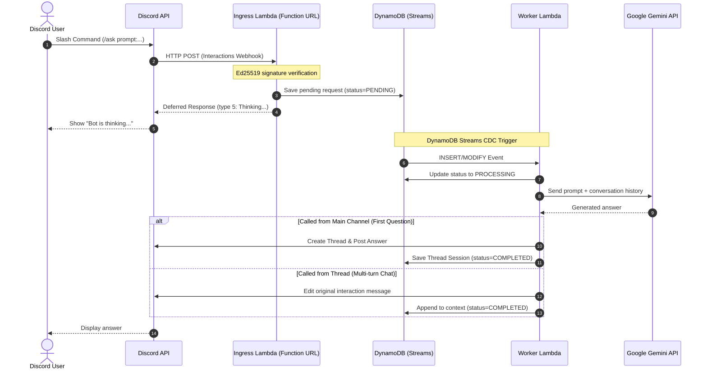

# terraform-aws-discord-gemini

Terraform module to deploy a fully serverless, thread-aware Discord AI Bot powered by Google Gemini (3.7 Flash) on AWS (Lambda Function URL + DynamoDB Streams CDC).

---

## ✨ Features

- **Multi-turn Thread Conversations**:
  - Automatically creates a new thread when `/ask` is called in a main channel.
  - Keeps conversation context across turns when continuing in the thread.
- **100% Serverless & Zero Idle Cost**:
  - Uses Discord HTTP Interactions (Lambda Function URL) instead of persistent WebSockets (no ECS/EC2 needed).
- **Sub-3s Discord Interaction Safe**:
  - Dual-Lambda architecture: Ingress (immediate deferred response) + Worker (DynamoDB Streams CDC).
- **Auto Cleanup**:
  - Automatically expires conversation history after 7 days using DynamoDB TTL.
- **Standard Terraform Module**:
  - Ready to be used via `source = "github.com/nizyu/terraform-aws-discord-gemini"`.

---

## 🏗️ Architecture



---

## 📁 Repository Structure

```
.
├── main.tf                       # Module locals & provider configuration
├── variables.tf                  # Module inputs (with release_tag)
├── outputs.tf                    # Module outputs (Function URL, Table Name, ARNs)
├── downloads.tf                  # Automatic download of release zip assets
├── dynamodb.tf                   # DynamoDB Table with Streams, TTL, and PITR
├── lambda_ingress.tf             # Ingress Lambda Function & Function URL
├── lambda_worker.tf              # Worker Lambda Function & Stream Mapping
├── iam.tf                        # IAM roles & minimal privilege policies
├── src/
│   ├── ingress/                  # Ingress Lambda (Python 3.12, Ed25519 verification)
│   │   ├── handler.py
│   │   └── requirements.txt
│   └── worker/                   # Worker Lambda (Python 3.12, Gemini & Discord client)
│       ├── handler.py
│       ├── gemini_client.py
│       ├── discord_client.py
│       └── requirements.txt
├── scripts/
│   ├── package.py                # Lambda build & packaging script
│   └── register_commands.py      # Slash command registration helper
├── docs/
│   └── setup_guide.md            # Step-by-step setup guide
└── examples/
    └── basic/                    # Example deployment configuration
        ├── main.tf
        ├── variables.tf
        └── terraform.tfvars.example
```

---

## 🚀 Quick Start

See **[docs/setup_guide.md](docs/setup_guide.md)** for complete setup and Discord Bot creation instructions.

### Basic Module Usage

```hcl
module "discord_gemini" {
  source = "github.com/nizyu/terraform-aws-discord-gemini"

  discord_application_id = "YOUR_DISCORD_APPLICATION_ID"
  discord_public_key     = "YOUR_DISCORD_PUBLIC_KEY"
  discord_bot_token      = "YOUR_DISCORD_BOT_TOKEN"
  gemini_api_key         = "YOUR_GEMINI_API_KEY"
  gemini_model           = "gemini-3.7-flash"
}
```

### Register Slash Command (`/ask`)

```bash
python scripts/register_commands.py \
  --application-id YOUR_DISCORD_APPLICATION_ID \
  --bot-token YOUR_DISCORD_BOT_TOKEN
```

---

## 📖 Documentation

- [Discord & AWS Setup Guide (`docs/setup_guide.md`)](docs/setup_guide.md)

---

## 📄 License

MIT License
