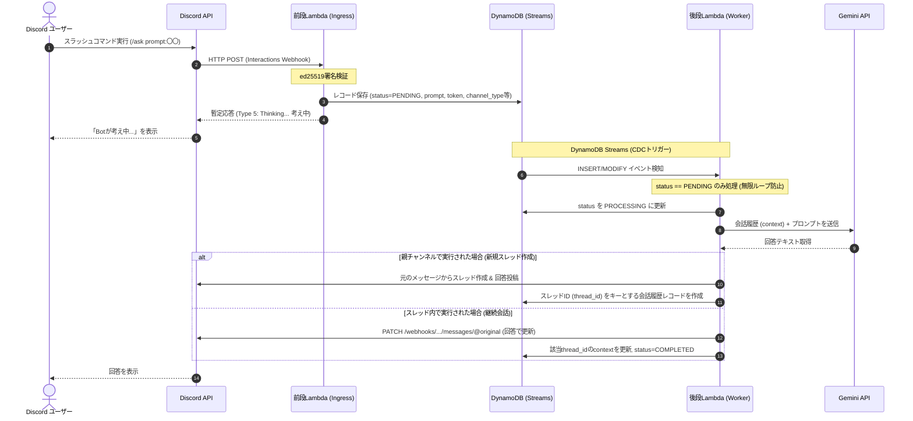

# Discord Gemini Bot 要件定義・基本設計書

本ドキュメントは、AWSサーバーレス構成（Lambda + DynamoDB + Terraform）で動作するDiscord用Gemini連携Botの仕様および設計書です。

---

## 1. 概要

Discordサーバー（家族用）において、Google Gemini APIを活用したAIチャットBotを提供します。
Discordの3秒応答制限（Interaction Timeout）を考慮し、前段Lambda（受付・即時暫定回答）と後段Lambda（CDC / Gemini連携・最終回答）による完全非同期アーキテクチャを採用します。

---

## 2. 確定仕様・要件

### 2.1 機能要件
1. **トリガー方式**:
   - スラッシュコマンド `/ask <prompt>` による呼び出しに統一（常時起動サーバー不要の完全Lambda構成）。
2. **スレッド管理と会話コンテキスト**:
   - **親チャンネルでの呼び出し時**: 自動的に新規スレッド（Thread）を立ち上げ、そのスレッド内でGeminiの回答を返信。
   - **スレッド内での呼び出し時**: そのスレッドの過去の会話コンテキスト（履歴）を読み込み、文脈を加味した回答を返信。
3. **テキスト処理**:
   - テキスト入出力に特化（画像・音声等は対象外）。
   - Discordのメッセージ長制限（2,000文字）に対応（長文回答時は分割送信）。
4. **データ保持（TTL）**:
   - スレッドごとの会話履歴はDynamoDBで管理し、1週間（7日間）のTTLを設定して自動削除。

### 2.2 技術スタック・非機能要件
1. **クラウドインフラ**: AWS（Lambda Function URL, DynamoDB + Streams, IAM, CloudWatch Logs, SSM Parameter Store / Secrets Manager）
2. **Lambdaランタイム**: Python 3.12（boto3, PyNaCl, google-genai, requests / urllib）
3. **AIモデル**: Google Gemini API（デフォルト: `gemini-3.7-flash`、Terraform変数で変更可能）
4. **IaC**: Terraform Module として実装（再利用可能かつ容易にプロビジョニング可能）

---

## 3. システムアーキテクチャ



---

## 4. 詳細設計

### 4.1 前段Lambda (Discord Ingress)
- **エンドポイント**: Lambda Function URL (`AuthType: NONE`)
- **処理フロー**:
  1. `X-Signature-Ed25519` と `X-Signature-Timestamp` を用いてリクエストボディを署名検証（PyNaCl）。検証失敗時は HTTP 401。
  2. `type == 1` (PING) の場合、`{"type": 1}` (PONG) を返却。
  3. `type == 2` (APPLICATION_COMMAND) の場合:
     - コマンド名 `/ask` と引数 `prompt` をパース。
     - 実行されたチャンネルがスレッド（`channel.type in [11, 12]`）か親チャンネルかを判定。
     - DynamoDBへ `status: "PENDING"` でレコードを書き込み。
     - 3秒以内に `{"type": 5}` (DEFERRED_CHANNEL_MESSAGE_WITH_SOURCE) を返却。

### 4.2 DynamoDB テーブル設計
- **テーブル名**: `discord_gemini_sessions`
- **Partition Key (PK)**: `session_id` (String)
  - スレッド内での会話: `thread_id`
  - 新規スレッド作成前: `req_<interaction_id>`
- **Streams設定**: `NEW_AND_OLD_IMAGES`
- **TTL設定**: `ttl` 属性 (UNIXタイムスタンプ、作成/更新から7日後)
- **属性定義**:

| 属性名 | 型 | 説明 |
| :--- | :--- | :--- |
| `session_id` | String (PK) | スレッドIDまたは一時リクエストID |
| `status` | String | 処理状態 (`PENDING` / `PROCESSING` / `COMPLETED` / `ERROR`) |
| `is_new_thread` | Boolean | 親チャンネルからの初回呼び出しフラグ |
| `channel_id` | String | 呼び出し元チャンネルID |
| `parent_message_id` | String | InteractionのメッセージID (スレッド作成用) |
| `application_id` | String | Discord Application ID |
| `interaction_token` | String | Discord Interaction Token (15分間有効) |
| `user_id` | String | 実行ユーザーID |
| `user_name` | String | 実行ユーザー表示名 |
| `prompt` | String | ユーザーの入力テキスト |
| `context` | List of Maps | Gemini API形式の会話履歴 `[{"role": "user"|"model", "parts": [{"text": "..."}]}]` |
| `ttl` | Number | 有効期限 (エポック秒: 7日後) |
| `created_at` | String | 作成日時 (ISO8601) |
| `updated_at` | String | 更新日時 (ISO8601) |

### 4.3 後段Lambda (Gemini Worker)
- **トリガー**: DynamoDB Streams (`batch_size = 1`, `starting_position = LATEST`)
- **処理フロー**:
  1. イベント内の `NewImage` をチェック。`status == "PENDING"` でない場合はスキップ（無限ループ防止）。
  2. DynamoDBの `status` を `PROCESSING` に更新。
  3. **コンテキスト構築 & Gemini API呼び出し**:
     - `session_id` に既存 `context` があれば取得し、今回の `prompt` を追加。
     - Gemini API (`google-genai` SDK) を呼び出して回答を生成。
  4. **Discordへの応答送信**:
     - **新規スレッドの場合 (`is_new_thread == True`)**:
       - Interaction Followup API で「スレッドを作成しました」等のメッセージを更新し、そのメッセージに対してスレッドを作成 (`POST /channels/{channel_id}/messages/{message_id}/threads`)。
       - スレッド内にGeminiの回答を投稿 (`POST /channels/{thread_id}/messages`)。
       - DynamoDBに `session_id = thread_id` として新しい会話履歴レコードを保存。
     - **スレッド内の場合 (`is_new_thread == False`)**:
       - Interaction Followup API (`PATCH /webhooks/{application_id}/{interaction_token}/messages/@original`) で元の「考え中...」メッセージをGeminiの回答で上書き。
       - DynamoDBの該当レコードの `context` に今回のやり取り（ユーザープロンプト & AI回答）を追加し、`status` を `COMPLETED` に更新。
  5. **エラーハンドリング**:
     - エラー発生時はDiscord上に「エラーが発生しました」と通知し、DynamoDBの `status` を `ERROR` に更新。

---

## 5. ディレクトリ・モジュール構成

```
.
├── docs/
│   ├── specification.md          # 本仕様書
│   └── setup_guide.md            # Discord App作成・デプロイ手順書
├── modules/
│   └── discord-gemini/           # Terraform モジュール
│       ├── main.tf               # モジュールメイン
│       ├── variables.tf          # 入力変数
│       ├── outputs.tf            # 出力（Function URL等）
│       ├── dynamodb.tf           # DynamoDB + Streams + TTL
│       ├── lambda_ingress.tf     # 前段Lambda + Function URL
│       ├── lambda_worker.tf      # 後段Lambda + EventSourceMapping
│       └── iam.tf                # IAMロール・ポリシー
├── src/
│   ├── ingress/                  # 前段Lambdaソースコード (Python 3.12)
│   │   ├── handler.py
│   │   └── requirements.txt
│   └── worker/                   # 後段Lambdaソースコード (Python 3.12)
│       ├── handler.py
│       ├── gemini_client.py
│       ├── discord_client.py
│       └── requirements.txt
├── scripts/
│   └── register_commands.py      # スラッシュコマンド登録用スクリプト
└── examples/
    └── basic/                    # モジュール呼び出し例
        ├── main.tf
        ├── variables.tf
        └── terraform.tfvars.example
```
